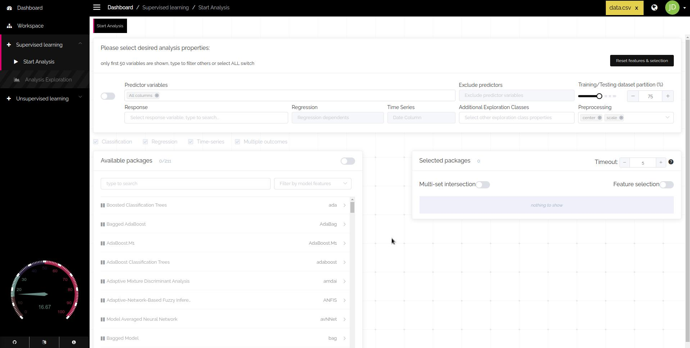

<div align="center">
    <p align="center">
        <a href="https://genular.org" target="_blank">
            </a>
    </p>
    <h1>SIMON<br/><sub>automated machine learning and feature discovery platform.</sub></h1>
    <p align="center">
        <a href="https://crowdin.com/project/genular" alt="Help us translate">
            </a>
        <a href="https://app.fossa.io/projects/git%2Bgithub.com%2Fgenular%2Fsimon-frontend?ref=badge_small" alt="Licence">
            </a>
        <a href="#reposize">
            </a>
        <a href="https://twitter.com/intent/follow?screen_name=genular" alt="Follow us on twitter">
            </a>
        <a href="http://webchat.freenode.net/?randomnick=1&channels=genular&uio=d4" alt="chat on freenode">
            </a>
        <a href="https://app.netlify.com/sites/genular/deploys" alt="netlify status">
            </a>
    </p>
</div>

## Intro

`SIMON` is a powerful, flexible, open-source and easy to use knowledge discovery application. <a href="https://dashboard.genular.org" target="_blank">(click here for demo)</a>
Currently `SIMON` implements automated machine learning (autoML) and statistical data discovery features
that will help you to easily illustrate dynamic relationships and provide you with a structural sense of your data.

Goal of this project is to make unified user interface that will empower anyone to extract meaningful information from their data and enable them to rapidly use machine learning algorithms. `It gives you freedom and control over your own models.` genular is an entirely open source organization, if you wish to learn more visit us [here](https://genular.org)

While `SIMON` can be used in across many different fields, 
our focus here is scientific community so we can enable scientist and other researchers in the field to quickly prototype around their data and get meaningful results out of it.

## Why is this so awesome?
* :chart: **automated machine learning** Automation of machine learning process for predictive analytics
* :file_folder: **feature discovery** You can discover relevant trends and patterns inside your data with ease, that would usually take years of manual handcrafting
* :package: **exploratory data analysis** Visual analysis of automated machine learning results will give you instant insights with help of many different visualization algorithms
* :arrows_counterclockwise: **sharing is caring** You can share your results with others, deploy your models instantly or download your data for external use
* :closed_lock_with_key: **privacy and security** By hosting `SIMON` on your own dedicated servers you don't have to worry about someone else is looking after your data

## Features



* **200+** automated machine learning algorithms to choose from
* nicely designed **drag&drop** user interface to easily apply data modeling techniques
* supports **local** and **cloud** backend storage architecture
* for-each model you can compare between **34 model performance measures**
* visual **data analysis** that supports *clustering* and *correlation graphs*
* visual **feature analysis** with dot-plots that supports **280 visual styles**
* visual **model comparison** with *box-and-whisker* style plots
* public dataset repository import to **easily import** and analyze pre-published data
* Integrated **SAM (Significance Analysis of Microarrays)** technique for finding significant genes in a set of microarray experiments
* Supports translation to **multiple languages**

---

## Installation Quickstart

### Easy
This section describes the process of pulling a pre-built version of `SIMON` from [DockerHub](https://hub.docker.com/).
If you are beginner this is recommended way to start `SIMON`. This can also be very handy for developers for development without polluting the host machine.
The `SIMON` source code includes a [Dockerfile](https://github.com/genular/simon-backend/blob/master/documentation/docker_images/Dockerfile).

#### Requirements
[Docker](https://docs.docker.com/engine/installation/) (`version 17.05` or later is required for building the image).
[Docker Windows](https://hub.docker.com/editions/community/docker-ce-desktop-windows)

#### Running SIMON Container
In order to run a test instance of `SIMON` we first need to prepare the environment.
If you finished installing docker please follow command below.
Lets pull the [genular/simon](https://cloud.docker.com/u/genular/repository/docker/genular/simon) image from DockerHub. Then run a Docker container with appropriately mounted volumes and port mapping. By default the container would run with a local file-system inside of it.

If you wish to get correct time., replace TZ=<timzone> with your timezone.
You can find list of supported timezones [here](https://en.wikipedia.org/wiki/List_of_tz_database_time_zones)

```bash
# This command will download and start SIMON
docker run --rm \
    --detach \
    --network=host \
    --name genular \
    --tty \
    --interactive \
    --env IS_DOCKER='true' \
    --env TZ=America/Los_Angeles \
    --publish 3010:3010 \
    --publish 3011:3011 \
    --publish 3012:3012 \
    --publish 3013:3013 \
    genular/simon:latest
```
Once the container is started you can open SIMON on `http://localhost:3010` and create your account.

##### Important
To exit/shutdown `SIMON` you must use following command when you are finished with your analytical work to save your progress, otherwise all your current session data will be lost:
If you configured your own database and file-system you don't need to do following step.
```bash
# Then get the docker container id using this command
docker ps
# Commit changes to the container
docker commit <CONTAINER_ID> genular:simon
```

### Advanced
To install and configure `SIMON` from source you will need knowledge of Linux, how to set up databases (MySQL) and web server (Apache, nginx) together with R and PHP setup and configuration.
> Installation instructions are located in [this file](https://github.com/genular/simon-frontend/blob/master/INSTALL.md).
> You can find semi-automated bash installation script [here](https://github.com/genular/simon-backend/blob/master/documentation/installation/install_dependencies.sh), that can also help you to get started.
> 
If you believe you don't have necessarily skills to do so, you could always ask a friend to help you or check out our [demo](https://dashboard.genular.org)

## Community

### Getting Help
Please **do not post** usage questions to GitHub Issues pages. 
For these types of questions use our [forum](https://community.genular.org)

### Submitting Bugs and Enhancements
[GitHub Issues](https://github.com/genular/simon-frontend/issues) is for suggesting enhancements and reporting bugs.
We appreciate all enhancements ideas and bug reports. Additionally if you think you can help us with suggesting new useful features we will gladly accept it.
Here you can find [bug report template](.github/ISSUE_TEMPLATE/bug_report.md) and [feature request template](.github/ISSUE_TEMPLATE/feature_request.md).

#### Contributing, writing code
Contributions are very much welcome!

If you need any help, please contact us [via email](mailto:info@genular.com).

1. Check out our [public issues board][0]. If your issue isn't on the board, [open a new one][1].
2. Pick an issue that nobody has claimed and start working on it.
3. Fork the project ([Need help forking a project?][3]). You'll do all of your work on your forked copy.
4. Create a branch specific to the issue or feature you are working on. Push your work on that branch ([Need help with branching?][4]).
5. Name the branch something like `fixes-xxx-issue` or `add-xxx-feature` where `xxx` is a short description of the changes or feature you are adding.
6. Once your code is ready, submit a pull request from your branch to SIMON `master` branch. We'll do a quick review and give you feedback.

[0]: https://github.com/genular/simon-frontend/issues
[1]: https://github.com/genular/simon-frontend/issues/new
[3]: https://help.github.com/articles/fork-a-repo/
[4]: https://github.com/Kunena/Kunena-Forum/wiki/Create-a-new-branch-with-git-and-manage-branches


### Places to Help
We're looking for co-maintainers! If you want to become one please write to [LogIN-](https://github.com/LogIN-) or drop us [email](mailto:info@genular.com).

In addition to contributing, optimizing and reviewing code, writing bug and feature requests you can help with following:

Project | How To Help | Next Step
--- | --- | --- |
Localization | Help us translate `SIMON` into your language. If some translation is missing or incorrect you can easily help us by correcting it. | [Join our Translation Community](https://crowdin.com/project/genular)
Tutorials | Help others use and understand `SIMON` | Write a tutorial or record it, with usage examples
Organizing | Ask clarifying questions on recently opened GitHub issues to move the discussion forward | [Here](https://github.com/genular/simon-frontend/issues)

## Browser Support
Tested on `Firefox Quantum 64` or above. As much as we like other browsers we are focusing here to primary provide support for open source ones.

### Reaching Out
If you'd like to start a conversation feel free to [e-mail us](mailto:info@genular.com).
I would also gladly like to hear from you if you find this project useful and helpful!

 * Join us on `#genular` on `freenode.net` (or use the [web client](https://webchat.freenode.net/?channels=genular)).
 * Find us [on Twitter](https://twitter.com/genular) under @genular
 * Check out [community forums](https://community.genular.org)

## Security Vulnerabilities
If you discover a security vulnerability within `SIMON`, please [e-mail us](mailto:info@genular.com). All security vulnerabilities will be promptly addressed. You are also welcome to open PR request.

## Additional Links
| Resource      | Link                                               |
| ------------- | -------------------------------------------------- |
| File an issue | https://github.com/genular/simon-frontend/issues        |
| Blog          | https://genular.org/blog/                      |
| Twitter       | https://twitter.com/genular                       |


## License
Please check `LICENCE` file for more information.

## Citation
This software can be used for research purposes, you should cite
the aforementioned papers in any resulting publication.

```bash
    Adriana Tomic, Ivan Tomic, Yael Rosenberg-Hasson, Cornelia L. Dekker, Holden T. Maecker, Mark M. Davis.
    SIMON, an automated machine learning system reveals immune signatures of influenza vaccine responses.
    Preprint available from bioRxiv 545186
    doi: https://doi.org/10.1101/545186
```